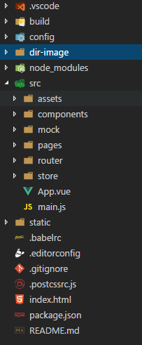
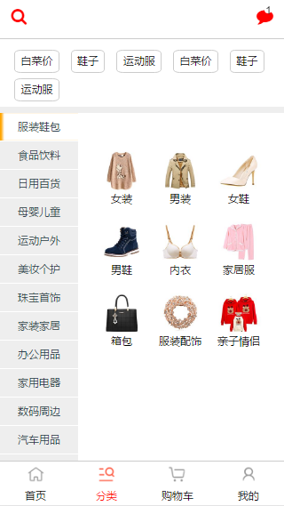
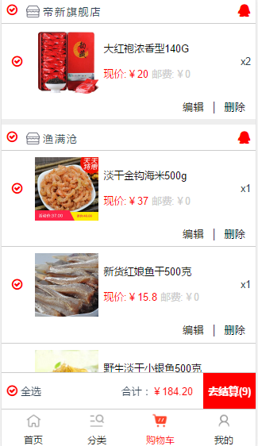
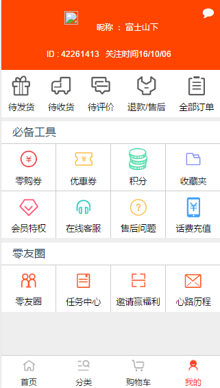
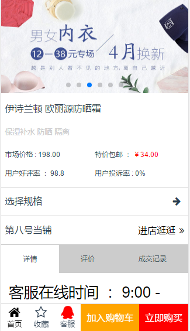

# 0gow-mall

> 0gow-mall with Vue Vuex Vue-router axios

## 安装步骤

``` bash
# install dependencies
npm install

# serve with hot reload at localhost:8080
npm run dev

# build for production with minification
npm run build

# build for production and view the bundle analyzer report
npm run build --report
```

# 0gow-mall
## 使用Vue生态系统开发的简易商城
### 工程目录结构




### 运行界面










#### 最后
>该商城仅仅完成了部分功能，仅是为了更加熟悉vue的使用方式